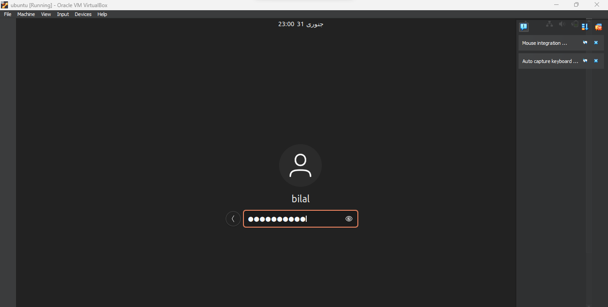
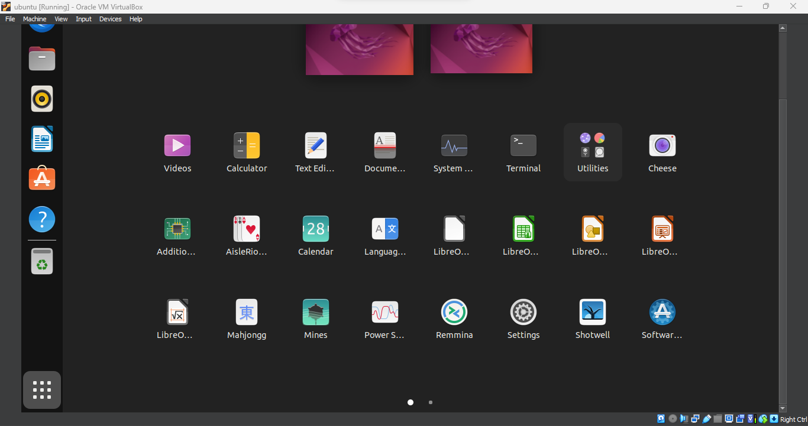
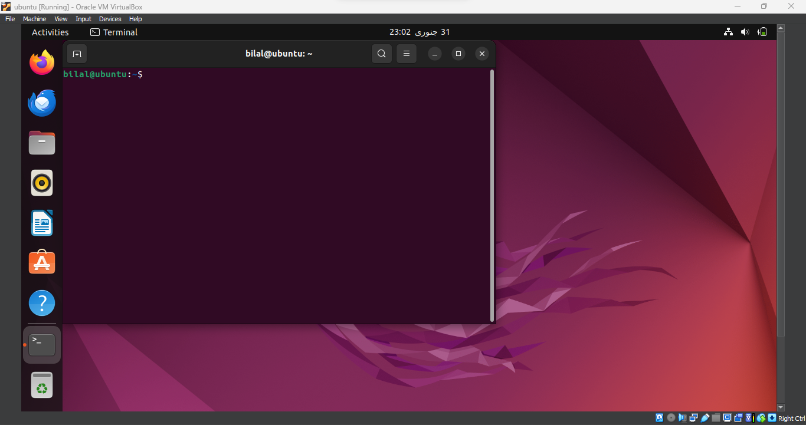
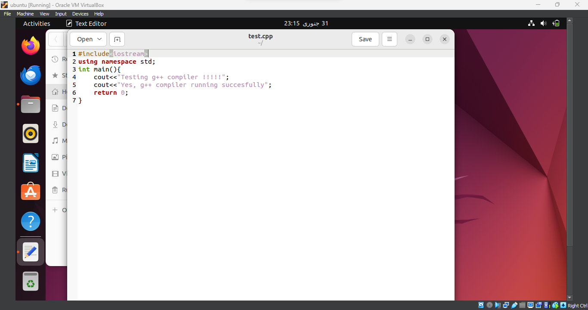
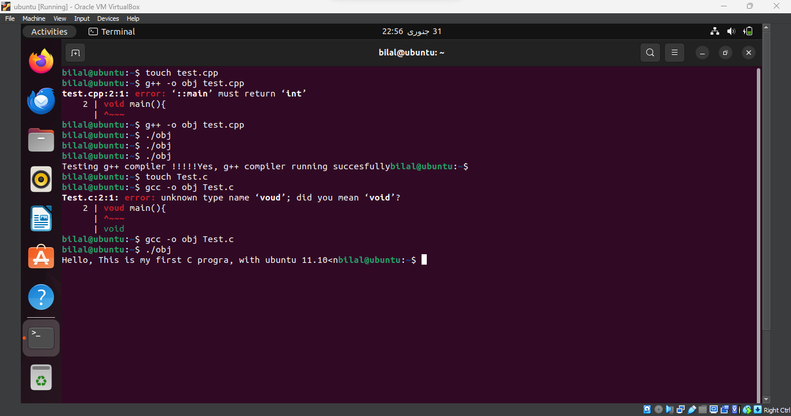

<b style="font-size:24px;">Operating System</b>

 Session: 2022 – 2026  
									

<b style="font-size:20px;">Submitted by: </b>
  Bilal Iftikhar &nbsp;&nbsp;&nbsp;&nbsp;&nbsp;&nbsp;&nbsp;&nbsp;&nbsp;&nbsp;&nbsp;&nbsp;&nbsp; 2022-CS-19  

​								        

<b style="font-size:20px;"> Submitted to:  </b>
     Sir Nauman Shafi 
    Sir Aqib  Chatthab  
								    	    

 ​							 “Department of Computer Science”

<b style="font-size:19px;"> University of Engineering and Technology 

<b style="font-size:19px;"> Lahore Pakistan  	

​									       

​							 			 

#                                                  LAB 2

###                                                          **TASK 1**:

##### Step 1: (VMware Workstation)

1. Download and install VMware Workstation.
2. Open VMware Workstation.

##### Step 2: (Create a New Virtual Machine)

1. Navigate to "File" > "New Virtual Machine."
2. Select the "Typical" option and proceed with "Next."
3. Select "Installer disc image file (iso)" and locate your Ubuntu ISO.
4. Provide a name and designate a location for your virtual machine. Click "Next."
5. Set the disk capacity and confirm with "Finish."

##### Step 3: (Install Ubuntu)

1. Power up the virtual machine.
2. Choose your preferred language, select "Install Ubuntu," and adhere to on-screen instructions.
3. Specify your location, keyboard layout, and establish a user account.
4. Decide on the installation of third-party software.
5. Upon completion, initiate a system restart by clicking "Restart Now."

##### Step 4: (Post-Installation)

1. Safely eject the installation media and press "Enter."
2. Log in using the credentials for the user account created during installation.

##### Conclusion:

Congratulations! Ubuntu is now successfully installed on VMware.

#### Screen Snapshots:

##                                                          TASK 2:

- Start by generating a file in the terminal using the `touch` command and specifying the desired file name.
- Go to the directory labeled "files" where the file was generated.
- Access the recently created file.
- Within the file, craft programs to verify the installation status of the `g++` and `gcc` compilers.
- Save and subsequently close the file.
- Proceed to compile and run the programs to confirm the status of the compiler installations.

#### Screen Snapshots:

##                                                          TASK 3:

##### GitHub Repository Link:

https://github.com/mughalbilal08/OS-Lab